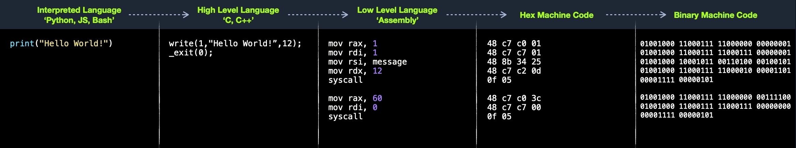
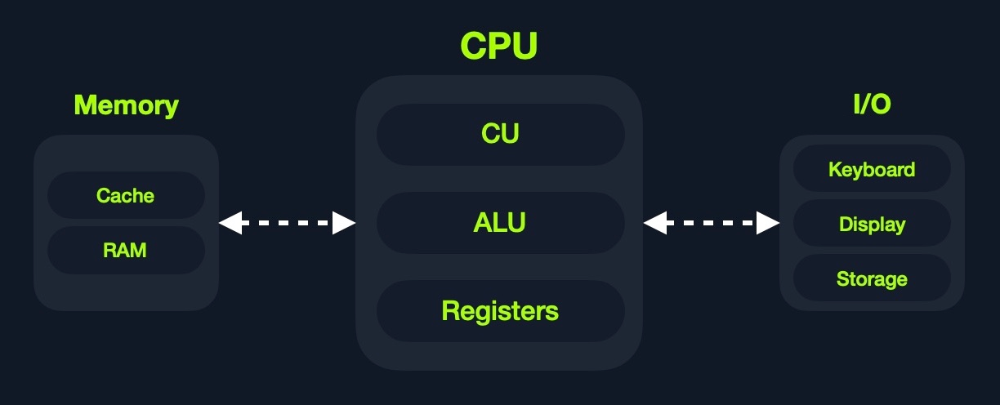

<h1>Assembly Language</h1>

-It is a low-level language that allow human to interact with the computer since the computer knows only 1 or 0.

-This instruction can be inject to the computer memory

<h1>Computer Architecture</h1>


Normally, data is sent to cache or RAM. This is where data are being stored. Then, from cache, data will be sent to CPU (Central Processing Unit) in which the CPU will call for a pointer to give an order where data will be sent to.


HIGH LEVEL vs LOW LEVEL
---


Example of Assembly code

```
mov rax, 1
mov rdi, 1
mov rsi, message
mov rdx, 12
syscall

mov rax, 60
mov rdi, 0
syscall
```

The shellcode would look like this or we can call it hex code.

```
48 c7 c0 01
48 c7 c7 01
48 8b 34 25
48 c7 c2 0d
0f 05

48 c7 c0 3c
48 c7 c7 00
0f 05
```

then the computer changes the shellcode into binary

```
01001000 11000111 11000000 00000001
01001000 11000111 11000111 00000001
01001000 10001011 00110100 00100101
01001000 11000111 11000010 00001101 
00001111 00000101

01001000 11000111 11000000 00111100 
01001000 11000111 11000111 00000000 
00001111 00000101
```

Tip: Java operates similarly to assemly. To make it easier to understand.
```
Java Bytecode > shell code or machine code using Java runtime > binary
```

<h1>CPU Components</h1>

CPU or Computer Processing Unit has 3 components:

-Control Unit (CU)

-Arithmetic/Logic Unit (ALU) = For calculatio tasks

-Registers = fastest 



Clock Speed & Clock Cycle
---

Each cycle is equal to one instruction. Modern CPU have multiple cores. This means that CPU can process multiple instructions at a time. 


How CPU works?
---


**Instruction	Description**

1. Fetch	Takes the next instruction's address from the Instruction Address Register (IAR), which tells it where the next instruction is located.
2. Decode	Takes the instruction from the IAR, and decodes it from binary to see what is required to be executed.
3. Execute	Fetch instruction operands from register/memory, and process the instruction in the ALU or CU.
4. Store	Store the new value in the destination operand.

MEMORY
---

Memory in CPU have 2 types.

1. Cache - Pretty fast and faster than RAM
2. RAM - is bigger than cache 

When programs are running. it send intructions to storage > RAM to prepare for CPU since storage couldn't handle both things at the same time. 

RAM
---

There are 4 components in RAM.

1. Stack - Has a Last-in First-out (LIFO) design and is fixed in size. Data in it can only be accessed in a specific order by push-ing and pop-ing data.
2. Heap - Has a hierarchical design and is therefore much larger and more versatile in storing data, as data can be stored and retrieved in any order. However, this makes the heap slower than the Stack.
3. Data - Has two parts: Data, which is used to hold variables, and .bss, which is used to hold unassigned variables (i.e., buffer memory for later allocation).
4. Text - Main assembly instructions are loaded into this segment to be fetched and executed by the CPU.

<h1>IO/Storage</h1>

This storage gives command to input/output devices using **bus interfaces**. This bus interface uses electric to communicate with CPU which convert to binary later. Storage is the slowest because it stores permanent information such as OS files.

|  Component | Speed | Size |
| ------------- | ------------- | -------- |
| Registers  | Fastest | Bytes |
| L1 Cache  | Fastest, other than Registers | Kilobytes |
|  RAM | Much slower than all of the above  | Megabytes |
| L2 Cache  | Very fast |Megabytes |
|  L3 Cache | Fast, but slower than the above | Gigabytes-Terabytes |
| Storage  | Slowest  | Terabytes and more |

Processor Specific
---
Each processor understands a different set of instructions. For example, while an Intel processor based on the 64-bit x86 architecture may interpret the machine code 4883C001 as add rax, 1, an ARM processor translates the same machine code as the biceq r8, r0, r8, asr #6 instruction. As we can see, the same machine code performs an entirely different instruction on each processor.

