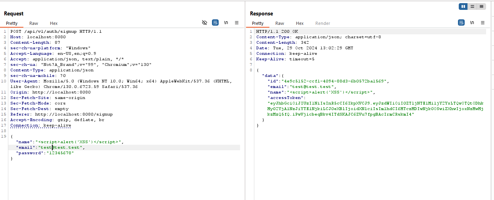
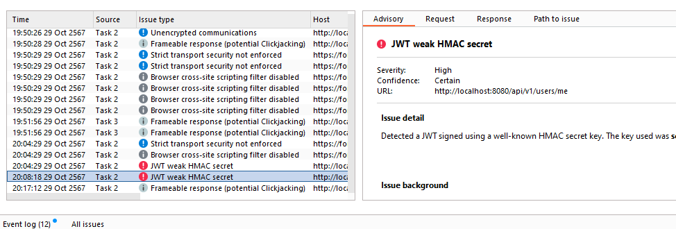
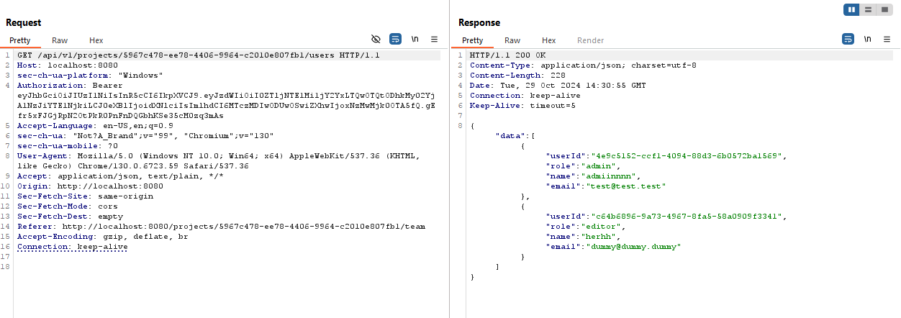

**Researched by Suphawith Phusanbai**

<h1>Ever Traduora</h1>

Ever® Traduora™ - Open Translation Management Platform

GitHub repo: https://github.com/ever-co/ever-traduora

**Findings**

**Details**

Technology stack:

-Database = MySQL

-API = REST API (there is API docs in github repo)

-Session token = JWT

-Typescript, NodeJS 

In sign up page, name input isn't sanitized

JWT token is using weak HMAC token which is **secret**

found in 

App logic: when a user creates a new project it becomes the **admin** automatically.

Upon observing JWT token. Sub data is using UUID4. UUID4 is unlikely to be predictable. So nope, we can't craft JWT token. rip.

Reading API docs, i used **/api/v1/projects/5967c478-ee78-4406-9964-c2010e807fb1/users** to identified userID which i will use for crafting JWT token.

