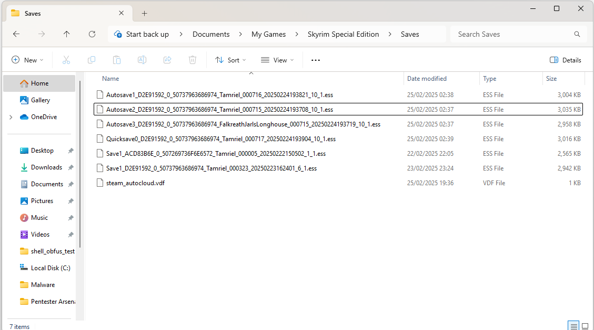
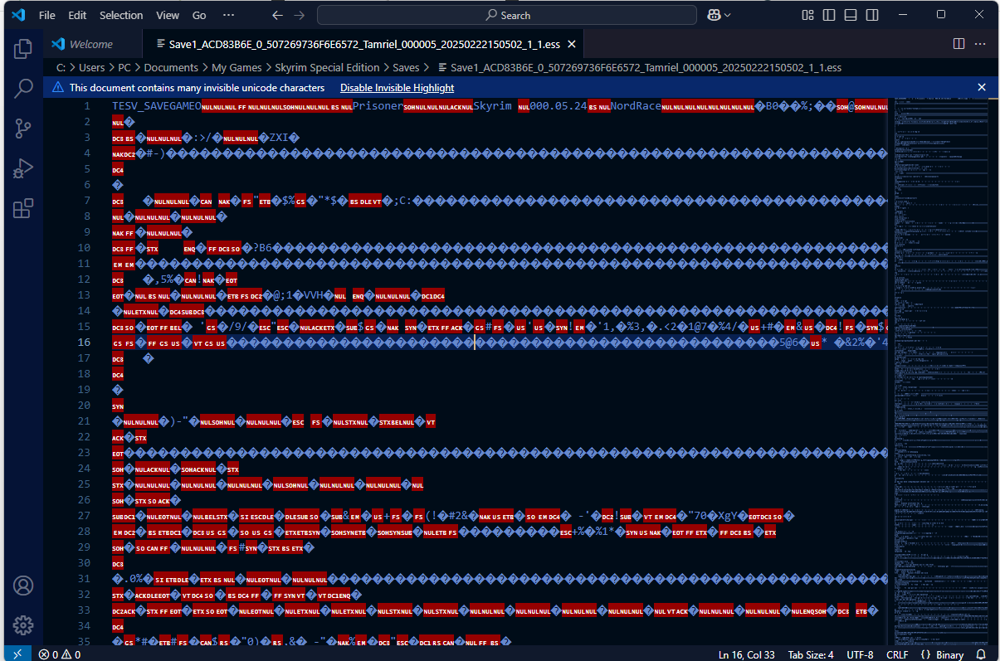

1. I went to %USERPROFILE%/Documents/My Games/Skyrim Special Edition/Saves to inspect what file extension is save file is.
---



2. Upon inspection, the save file extension is .ess which i need to research more.
---
```
PS C:\Users\PC\Downloads> [IO.Path]::GetExtension('C:\Users\PC\Documents\My Games\Skyrim Special Edition\Saves\Autosave1_D2E91592_0_50737963686974_Tamriel_000716_20250224193821_10_1.ess')
.ess
```

3. I decided to inspect the ".ess" file in VSCode
---


As you can see, the content of the file is binary.

4. After some research, i discover the ".ess" file is The Elder Scrolls Saved Game (.ess). 
---
```
Source: https://gist.github.com/felipepodesta/e87252275b437133d2f0
```
